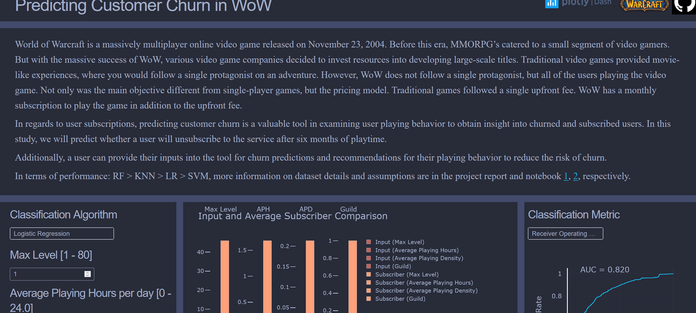

# Predicting Customer Churn in World of Warcraft

<p align="center">
  
</p>


## Objective
* Complete Exploratory Data Analysis.
* Complete Survival Analysis.
* Predict if a user will churn in a six-month period using classification algorithms.

## Background Information
* World of Warcraft is a massively multiplayer online video game released on November 23, 2004. Before this era, MMORPG’s catered to a small segment of video gamers. But with the massive success of WoW, various video game companies decided to invest resources into developing large-scale titles. Video games were sought out as movie-like experiences, where you follow a single protagonist. However, WoW did not follow a single protagonist, but all the users playing the video game. Not only was the main objective different from single-player games, but the pricing model. Traditional games followed a single upfront fee. In addition to the single upfront fee, WoW had a monthly subscription to play the game. With customer subscriptions in mind, we can apply the use of churn prediction to not only predict whether a customer will unsubscribe from the service but explore the user’s playing behavior to obtain more insight into user playing patterns. The churn problem is somewhat complex due to the nature of not having a one size fits all solution – as different services define churn in a variety of ways.

---

## Repository Structure
```plaintext
Customer-Churn-in-World-of-Warcraft/
├── assets/                                 # Directory containing asset files
├── data/                                   # Directory containing data files
├── .gitattributes                          # Git configuration attributes
├── Animation.gif                           # GIF demonstrating the project's functionality
├── Customer Churn Application Dashboard.ipynb  # Jupyter Notebook for the application dashboard
├── Customer Churn in World of Warcraft.ipynb   # Jupyter Notebook for the main analysis
├── Customer Churn in World of Warcraft_Report.pdf  # PDF report of the analysis
└── README.md                               # Overview of the repository
```
---


## Process:
* [Dataset](https://www.kaggle.com/mylesoneill/warcraft-avatar-history)
* Exploratory Data Analysis conducted utilizing various python packages (Numpy, Matplotlib, Pandas, and Plotly).'
* Survival Analysis (Lifelines)
    * Kaplan Meier Estimator
* Binary Classification Algorithms (Sci-Kit Learn)
    * Logistic Regression
    * Support Vector Machines
    * K-nearest neighbors
    * Random Forests


## Table of Contents:
* Part I: Exploratory Data Analysis
    * EDA
* Part II: Churn Prediction
    * Survival Analysis
    * Binary Classification
    
* Pertinent Deliverables
	* [Jupyter Notebook](https://github.com/SulmanK/Customer-Churn-in-World-of-Warcraft/blob/master/Customer%20Churn%20in%20World%20of%20Warcraft.ipynb)
	* [Project Report](https://github.com/SulmanK/Customer-Churn-in-World-of-Warcraft/blob/master/Customer%20Churn%20in%20World%20of%20Warcraft_Report.pdf)
	* [Dashboard](http://ccwow-env.eba-xp4yg5th.us-east-1.elasticbeanstalk.com/)
		* Disclaimer: Due to memory constraints from AWS (free server), less data was used in fitting the models (17500 instead of 35000), and therefore the results will be different than the values listed in the report.  

* Demo



* References
	* Yeng-Ting Lee, Kuan-Ta Chen, Yun-Maw Cheng, and Chin-Laung Lei, "World of Warcraft Avatar History Dataset," In Proceedings of ACM Multimedia Systems 2011, Feb 2011. 
	
	* M. Oneil, "myles-oneill/WoWAH-parser", GitHub, 2020. [Online]. Available: https://github.com/myles-oneill/WoWAH-parser. [Accessed: 18- Mar- 2020]. 

	*  L. Zhao et al., "On the restricted mean survival time curve in survival analysis", Biometrics, vol. 72, no. 1, pp. 215-221, 2015. Available: 10.1111/biom.12384. 

	*  P. Royston and M. Parmar, "Restricted mean survival time: an alternative to the hazard ratio for the design and analysis of randomized trials with a time-to-event outcome", BMC Medical Research Methodology, vol. 13, no. 1, 2013. Available: 10.1186/1471-2288-13-152. 

	*  "Classification: ROC Curve and AUC |  Machine Learning Crash Course", Google Developers, 2020. [Online]. Available: https://developers.google.com/machine-learning/crash-course/classification/roc-and-auc. [Accessed: 31- Mar- 2020]. 

	* P. Burman, "A Comparative Study of Ordinary Cross-Validation, v-Fold Cross-Validation and the Repeated Learning-Testing Methods", Biometrika, vol. 76, no. 3, p. 503, 1989. Available: 10.2307/2336116. 

	* C. Peng, K. Lee and G. Ingersoll, "An Introduction to Logistic Regression Analysis and Reporting", The Journal of Educational Research, vol. 96, no. 1, pp. 3-14, 2002. Available: 10.1080/00220670209598786. 

	* S. Salcedo-Sanz, J. Rojo-Álvarez, M. Martínez-Ramón and G. Camps-Valls, "Support vector machines in engineering: an overview", Wiley Interdisciplinary Reviews: Data Mining and Knowledge Discovery, vol. 4, no. 3, pp. 234-267, 2014. Available: 10.1002/widm.1125. 

	* Cunningham, Padraig & Delany, Sarah. (2007). k-Nearest neighbour classifiers. Mult Classif Syst. 

	* L. Breiman, "Random Forests", Machine Learning, vol. 45, no. 3, pp. 261-277, 2001. Available: 10.1023/a:1017934522171. 

	* P. Probst, M. Wright and A. Boulesteix, "Hyperparameters and tuning strategies for random forest", Wiley Interdisciplinary Reviews: Data Mining and Knowledge Discovery, vol. 9, no. 3, 2019. Available: 10.1002/widm.1301. 

	* A. Tharwat, "Principal component analysis - a tutorial", International Journal of Applied Pattern Recognition, vol. 3, no. 3, p. 197, 2016. Available: 10.1504/ijapr.2016.079733. 

	* "Survey Report on K-Means Clustering Algorithm", International Journal of Modern Trends in Engineering & Research, vol. 4, no. 4, pp. 218-221, 2017. Available: 10.21884/ijmter.2017.4143.lgjzd. 

